# Turtle Tallies

[Live Site](https://turtle-tallies.herokuapp.com/)

1. [Introduction](#introduction)
2. [Technologies used](#technologies-used)
3. [Features](#features)
4. [Testing](#testing)
5. [Bugs](#bugs)
6. [Credits](#credits)
7. [Deployment](#deployment)
8. [Acknowledgements](#acknowledgements)

## Introduction

***

Turtle Tallies is a program designed to automate data analysis for a turtle nest abundance study.  
It allows users to input collected data and calculations are carried out on the nest abundance of green and loggerhead turtles.
It calculates the total abundance of nests, nests laid by Green Sea Turtles and nests laid by Loggerhead sea turtles. It compares this total data to the previous year, and can do so broken down into weekly totals.

### Project Background

This is a potential project to investigate the nesting abundance of sea turtles in the Mediterranean, to address a knowledge gap identified in a 2018 review ([Casale, Broderick, Camiñas and Cardona et al., 2018](https://www.researchgate.net/publication/328047848_REVIEW_Mediterranean_sea_turtles_current_knowledge_and_priorities_for_conservation_and_research)). Two turtle species nest here, the Green sea turtle and the Loggerhead turtle.  
The project is undertaken annually over the month of June during the turtle nesting season. Two beaches in Cyprus are patrolled at night to record the turtle data. If a turtle attempts to lay a nest but leaves, their ID and this attempt is recorded to investigate in the future if the beaches surroundings could be impacting the nesting behaviour. If a nest is laid the data is recorded and the nest is marked and protected.   
  
The focus of this study is to calculate the abundance of nests on two beaches in North Cyprus, and how many each species is laying. This project is in the early stages of a long term study investigating the nesting abundance of these two turtle species.  
The ID tags are used to identify the turtles so in the future a record is kept for how often they nest, and if they always return to the same beach. If a turtle does not have an id tag, one is put on while the turtle is laying her nest and oblivious to her surroundings.    
The location is recorded, but not currently used in this study. It will be implemented in the future to compare yearly abundances on the beaches.  
Temperature data loggers record the temperature of the nest over the period it is in it. This will be used to estimate the sex of the hatchlings (cold temperatures produce males, warm temperatures females and inbetween can result in a mixed gendered nest). The data returned from these are not relevant to this project, but it's important to know for other studies to know which nests have them, and so its important for this study to know how many are in stock.

## Data Model

Each worker / volunteer will be given a standardised form to record data. This data is then entered directly into the program which sends it to a google sheet to be stored and manipulated.

Front of data collecter's sheet

Back of data collecter's sheet

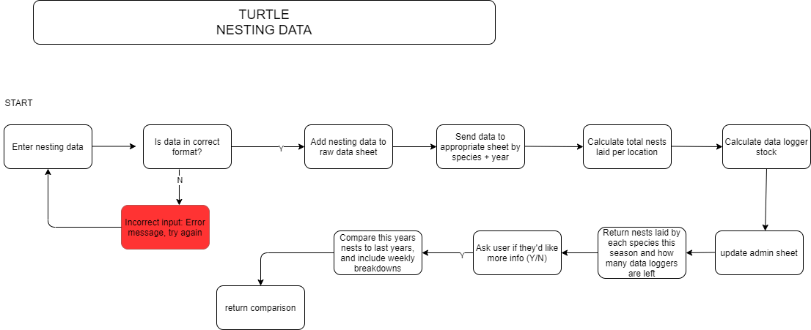

The above diagram is a simplified version of the program which exists. The user enters the data which is validated at each step, and then when confirmed to be correct it is sent to the google sheet. The data is sent to a total sheet and the corresponding turtle species' sheet. The total number of nests laid by each and both turtles is tallied, as well as the weekly tallies for both. This information is returned to the user in a user friendly, easy to read way.  
The project was initally going to compare nest abundance on each beach, but due to time constraints this wasn't possible to include. This a future feature to be implemented.

The spreadsheet has 8 worksheets, 7 of which are accessible by this program. Each year has 3 worksheets, which follow a similar naming convention for ease of understanding as the project progresses. They are raw_year, green_year and log_year. 
The raw worksheets contain all the information input by the user for that year's season. The green worksheets contain that years green turtle nest information. The log worksheets contain that years Loggerhead nest information. The admin data isn't stored from year to year, but are stored for the program to read and return to user.
The info worksheet isn't accessed by this program, but gives some basic understanding of the project and what data is being collected. This is useful for understanding what data has been calculated and why, if for some reason the spreadsheet is read by an external source.

Click to expand

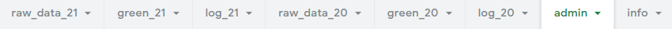

 

- raw_data_21 contains all the turtle data for the 2021 season, and is the year currently being added to when the program is used. It also stores weekly data for how many turtle nests were laid in that week.
    

    
Click to expand

    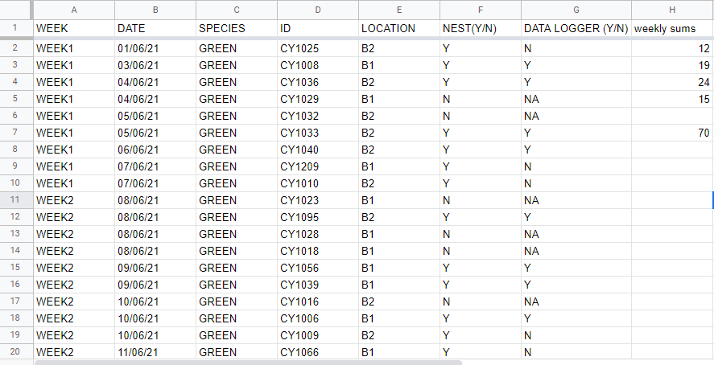

    

    
- green_21 contains the Green Turtle nesting data from the raw data sheet and the weekly sum of nests laid 
    

    
Click to expand

    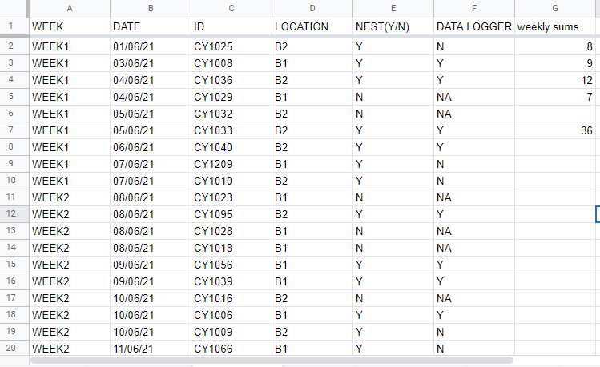

    

- log_21 contains the Loggerhead Turtle nesting data from the raw data sheet and the weekly sum of nests laid
    

    
Click to expand

    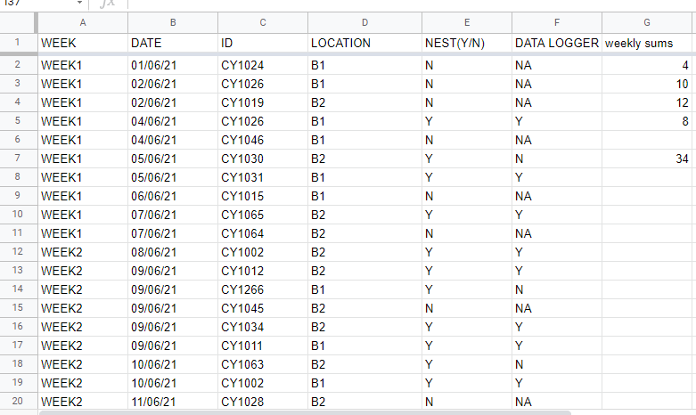

    

- raw_20 contains the full data collected in 2020
    

    
Click to expand

    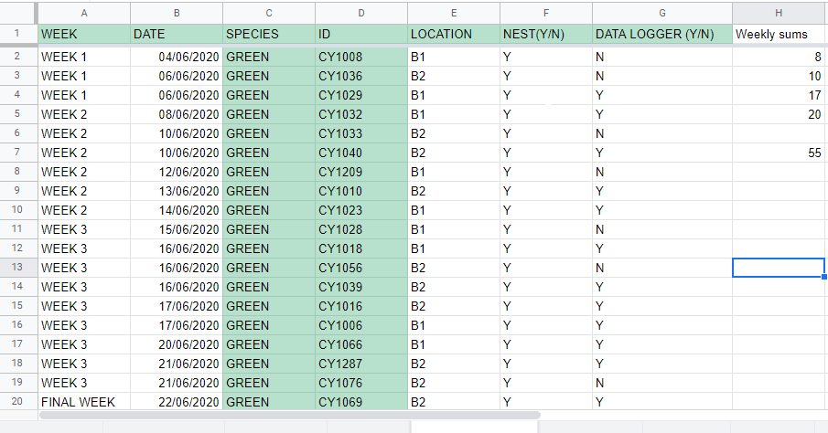

    

- green_20 contains the Green turtle nesting data from 2020
    

    
Click to expand

    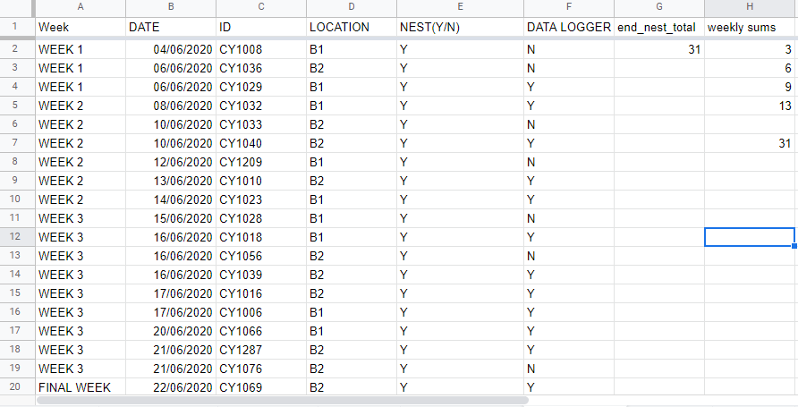

    

- log_20 contains the Loggerhead turtle nesting data from 2020
    

    
Click to expand

    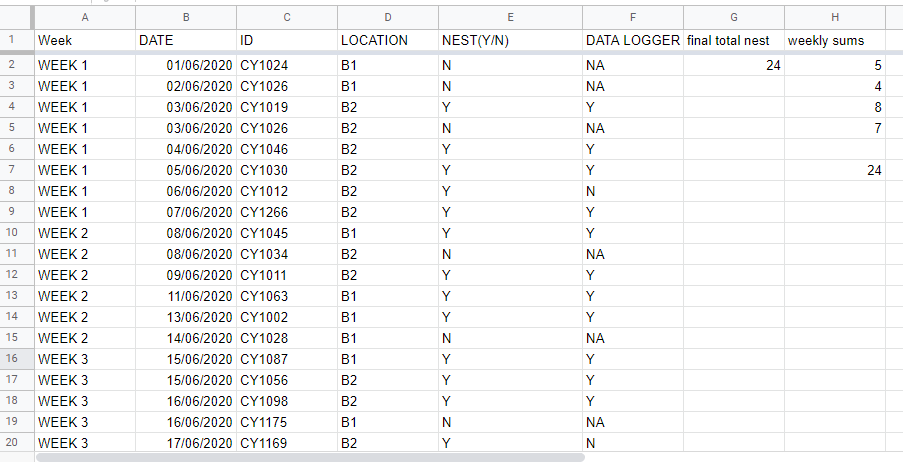

    

- admin stores calculation values to be returned to the user.  
data_log_stock: stores the result of the calculation for remaining temperature data loggers.  
total nests: stores the sum of all nests laid this season.  
last year total nests: stores the sum of all nests laid the previous year.  
total green: The number of nests laid by Green turtles this season.  
total log: The number of Loggerhead nests laid this season.  
green difference: The stored value of the number of last years green turtle nests minus this years.  
log difference: The stored value of the number of last years loggerhead turtle nests minus this years.	  
attempts: The total number of times turtles were recorded on the beach, whether they successfully built a nest or not.  
total difference: The stored value of the number of last years loggerhead turtle nests minus this years.	
    

    
Click to expand

    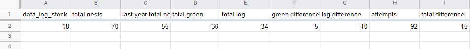

    

## Technologies Used

***

- This project was created completely with Python
- Libraries used
    - [gspread](https://docs.gspread.org/en/v3.7.0/) is the Google Sheets API which allows users to access and manipulate cells using Python functions.
    - [google auth](https://google-auth.readthedocs.io/en/master/) is the API which gives the program access to the google sheet using generated credentials.
    - [datetime](https://docs.python.org/3/library/datetime.html) allows user input (which is a string) for the date to be converted to readable date format for complete validation. If data entered does not match the format, is not a valid date, or is not within the month of June 2020, errors are easily returned to the user using this library.
    - [termcolor](https://pypi.org/project/termcolor/) allows users to change font colours from the standard white. This program provides a lot of feedback and information to the user which felt overwhelming and hard to digest. By including colour, it helps bring some clarity and makes the content much easier to recognise and process.

## Features

- Program is linked to googlesheet which is updated accordingly as the program runs
- Ascii image on startup of turtle swimming and title  
    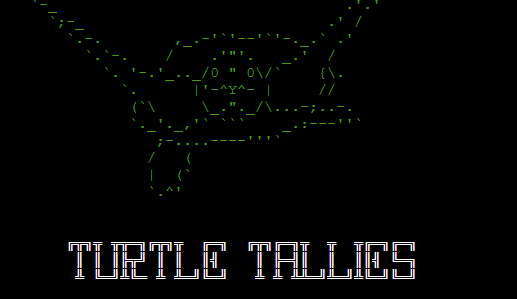  
- Welcome message to user, returning the name they input. Error is returned if input isn't alpha numeric.  
    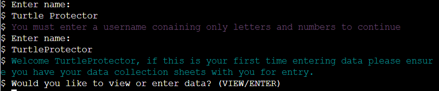
- Option to view summary of data at start of program
    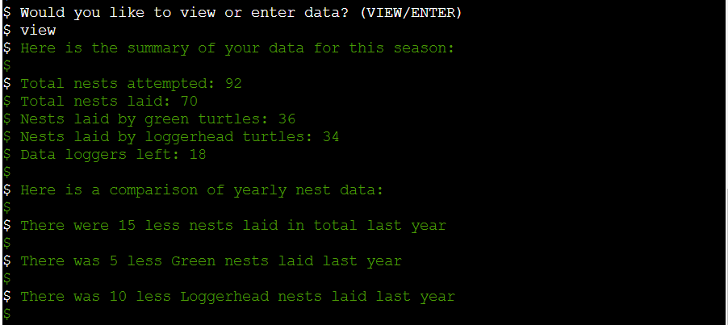
- Optional weekly comparisons  
    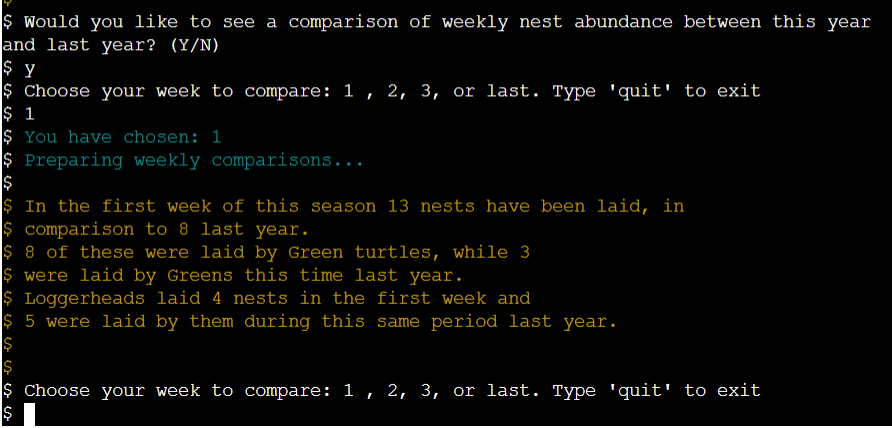
- Option to quit or input data after summary is viewed
    ![quit program][static/readme/quit.png]
- Easy to understand data input (ie, each bit is asked for and validated one at a time) 
    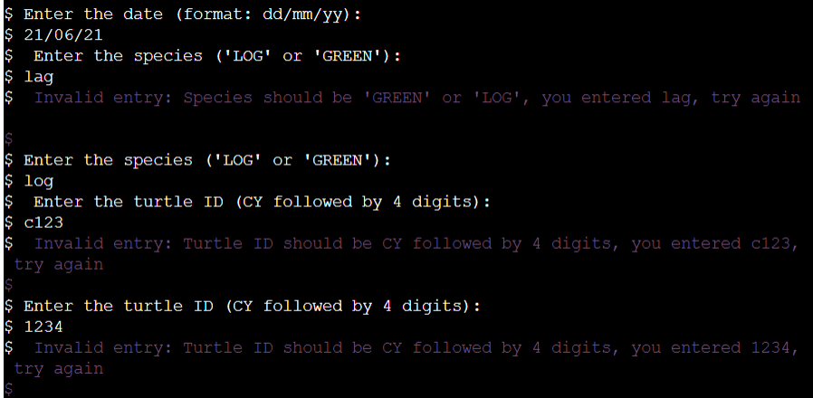
- Chance to review it was entered correctly (passes validation but mistyped) before being sent to googlesheet
- User is updated on what program is doing
- User is returned values from the calculations
- Validations at each step

### Calculations

- Total nests laid by both species
- Total nests attempted by both species
- Weekly total of nests by both species
- Total nests laid by Green turtles
- Weekly nests laid by Green turtles
- Total nests laid by Loggerhead turtles
- Weekly nests laid by Loggerhead turtles
- Difference in total nests laid between this year and last year
- Difference in Green turtle nests laid between this year and last year
- Difference in Loggerhead turtle nests laid this year and last year
- Comparison of weekly total, Green and Loggerhead nests between this year and last year
    - The project is broken into 4 'weeks'. Weeks 1 - 3 are standard weeks. The final 'week' is longer and covers the 22nd of June to the end of the month

### Future features / calculations

- Change data logger calculation message to order more when data loggers are less than 20 and it's not in the final 4 days.
- Save the users name so there is a record of who input the data 
- Add calculations to compare data between beaches
- Make turtle IDs searchable to bring up information on each
- Add future maintainability by adding in a feature to create new datasheets for new years
- Add date validation handling for when there is an issue with formatting eg, values entered aren't legitimate dates, to return a more user friendly error message
- Get text to appear letter by letter instead of whole statements at once

## Testing 

***

- I tested this program thoroughly and it was run through in its entirety countless times to ensure it worked correctly and all information entered was correctly validated.
- All features included currently work as expected.
 
- To do weekly comparisons I group the data by weeks and add the week to the information input by the user. When the user was asked to verify the information they entered was correct before sending it to the spreadsheet, this data appeared alongside the info they entered. I thought this could lead to confusion, so used the slice method to still add that extra information to the spreadsheet but prevent it being displayed to the user.

- Initially this program wasn't planned to offer the user the chance to view or enter data at the start. This meant users had to wait til the end of the program to view this data. By offering this summary at the start users don't need to enter data to view it, and don't need to go through the spreadsheet document.

### user testing
- The initial input method had the user entering all fields in one statement separated by commas. User feedback was this was awkward, and it was hard to remember what info needed to be entered and how despite having a formatting example. 
This was an unusual predicament because in the real world, the user inputting the information would have a filled out worksheet like the one above to enter data from. I still decided to change the user input to be entered and validated one at a time, and this seemed to improve the user experience.

- One user reported the inital colours other than white (blue, red and green) were hard to read over the black text. I changed the red to magenta, green to yellow, and blue to cyan and all subsequent testers reported it was easier to read.

### validation

- The program was validated with [pep8online](link here). The errors returned were XXX

## Bugs

***

Fixed:  

- For user_verify_input, 'y' isn't registered as 'Y' and it restarts the function. 
  This problem occurred throughout many validation functions and the same fix was applied throughout.
    - Fix: Add upper method.
-Data entered into worksheets wasn't uppercase
    - Fix: Add the upper() method before appending
- When data was added to species specific worksheets, the species data was also being transferred when there wasn't a column for it 
    - Add remove method to function to take species info away before appending to that sheet

Unsolved and removed:  

- Functions to mimic typing work perfectly in the terminal but not the deployed version on Heroku. I will look into this in the future but imagine it's a compatibility issue with the template used.
    
- Colour doesn't work properly for inputs - the coloured sentence is followed by 'None' where it is trying to colour the users input before it's entered. This ended up working out for the better as the white is a good contrast and makes it very noticeable where users are supposed to enter text.
    

### Terminal problems

The following problems are displayed in the terminal:

- mkaufman.htmlhint extension is not found in Open VSX
- kevinglasson.cornflakes-linter extension is not found in Open VSX
    - These are both issues with the .gitpod.yml file provided with the CI template and can be ignored  

 

- do not assign a lambda expression, use a def
    - When assigning coloured text an error is thrown over the use of lambda. These are ignored because assigning colours using lambda prevents longer repetitive code. See [here](https://towardsdatascience.com/prettify-your-terminal-text-with-termcolor-and-pyfiglet-880de83fda6b)

 

- invalid escape sequence '\ '
- Anomalous backslash in string: '\_'. String constant might be missing an r prefix.
    - These are both referring to the starting turtle image. The characters have no intended function other than to create and image and so these issues can be ignored. 

## Credits

***

- Media
    - Turtle image
        - http://www.ascii-art.de/ascii/t/turtle.txt
    - Text to text art
        - https://patorjk.com/software/taag/#p=display&v=0&f=Calvin%20S&t=TURTLE%20TALLIES

- Code
    - Colour text
        - https://towardsdatascience.com/prettify-your-terminal-text-with-termcolor-and-pyfiglet-880de83fda6b

## Deployment

***

This program is deployed using [Heroku](https://dashboard.heroku.com/login).

### Create App

### Setting up Heroku

### Deployment

### Forking Repository

### Cloning Repository
