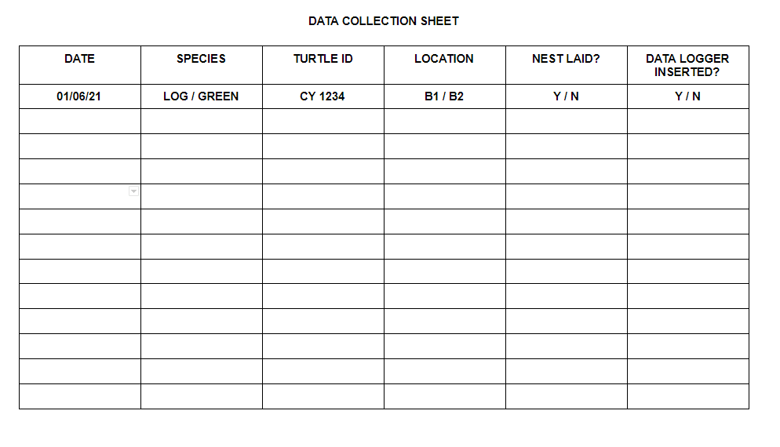

# Turtle Tallies

[Live Site](https://turtle-tallies.herokuapp.com/)

1. [Introduction](#1-introduction)
2. [Technologies used](#2-technologies-used)
3. [Testing](#3-testing)
4. [Bugs](#4-bugs)
5. [Credits](#5-credits)
6. [Deployment](#6-deployment)
7. [Acknowledgements](#7-acknowledgements)

## Introduction

***

Turtle Tallies is a program designed to automate data analysis for a turtle nest abundance study.  
It allows users to input collected data and calculations are carried out on the nest abundance of green and loggerhead turtles.
It calculates the total abundance of nests, nests laid by Green Sea Turtles and nests laid by Loggerhead sea turtles. It compares this total data to the previous year, and can do so broken down into weekly totals.

### Project Background

This is a potential project to investigate the nesting abundance of sea turtles in the Mediterranean, to address a knowledge gap identified in a 2018 review ([Casale, Broderick, Camiñas and Cardona et al., 2018](https://www.researchgate.net/publication/328047848_REVIEW_Mediterranean_sea_turtles_current_knowledge_and_priorities_for_conservation_and_research)). Two turtle species nest here, the Green sea turtle and the Loggerhead turtle.  
The project is undertaken annually over the month of June during the turtle nesting season. Two beaches in Cyrpus are patrolled at night to record the turtle data. If a turtle attempts to lay a nest but leaves, their ID and this attempt is recorded to investigate in the future if the beaches surroundings could be impacting the nesting behaviour. If a nest is laid the data is recorded and the nest is marked and protected.   
  
The focus of this study is to calculate the abundance of nests on two beaches in North Cyprus, and how many each species is laying. This project is in the early stages of a long term study investigating the nesting abundance of these two turtle species.  
The ID tags are used to identify the turtles so in the future a record is kept for how often they nest, and if they always return to the same beach. If a turtle does not have an id tag, one is put on while the turtle is laying her nest and oblivious to her surroundings.    
The location is recorded, but not currently used in this study. It will be implemented in the future to compare yearly abundances on the beaches.
Temperature data loggers record the temperature of the nest over the period it is in it. This will be used to estimate the sex of the hatchlings (cold temperatures produce males, warm temperatures females and inbetween can result in a mixed gendered nest). The data returned from these are not relevant to this project, but it's important to know for other studies to know which nests have them, and so its important for this study to know how many are in stock.

### Data required

Each worker / volunteer will be given a standardised form to record data. This data is then entered into the program to be stored in a google sheet document and analyses performed. 

Front

Back

### Calculations

- Total nests laid by both species
- Total nests attempted by both species
- Weekly total of nests by both species
- Total nests laid by Green turtles
- Weekly nests laid by Green turtles
- Total nests laid by Loggerhead turtles
- Weekly nests laid by Loggerhead turtles
- Difference in total nests laid between this year and last year
- Difference in Green turtle nests laid between this year and last year
- Difference in Loggerhead turtle nests laid this year and last year
- Comparison of weekly total, Green and Loggerhead nests between this year and last year
    - The project is broken into 4 'weeks'. Weeks 1 - 3 are standard weeks. The final 'week' is longer and covers the 22nd of June to the end of the month

## Technologies Used

***

- This project was created completely with Python
- The onscreen terminal is the Code Institute template

## Testing 

***

## Bugs

***

- For user_verify_input, 'y' isn't registered as 'Y' and it restarts the function
    - Fix: Add an or statement. Change this later to lower method if possible
-Data entered into worksheets wasn't changed to uppercase
    - Add the upper() method before appending
- When data was added to species specific worksheets, the species data was also being transferred when there wasn't a column for it 
    - Add remove method to function before appending
- Type_print works great in terminal, but not deployed version
    - NOT FIXED
- Colour doesn't work properly for inputs
    - NOT FIXED

### Terminal problems

The following problems are displayed in the terminal:

- mkaufman.htmlhint extension is not found in Open VSX
- kevinglasson.cornflakes-linter extension is not found in Open VSX
    - These are both issues with the .gitpod.yml file provided with the CI template and can be ignored  

 

- do not assign a lambda expression, use a def
    - When assigning coloured text an error is thrown over the use of lambda. These are ignored because assigning colours using lambda prevents longer repetitive code. See [here](https://towardsdatascience.com/prettify-your-terminal-text-with-termcolor-and-pyfiglet-880de83fda6b)

 

- invalid escape sequence '\ '
- Anomalous backslash in string: '\_'. String constant might be missing an r prefix.
    - These are both referring to the starting turtle image. The characters have no intended function other than to create and image and so these issues can be ignored. 

## Credits

***

- Media
    - Turtle image
        - http://www.ascii-art.de/ascii/t/turtle.txt
    - Text to text art
        - https://patorjk.com/software/taag/#p=display&v=0&f=Calvin%20S&t=TURTLE%20TALLIES

- Code
    - Colour text
        - https://towardsdatascience.com/prettify-your-terminal-text-with-termcolor-and-pyfiglet-880de83fda6b

## Deployment

***

This program is deployed using [Heroku](https://dashboard.heroku.com/login).

### Create App

### Setting up Heroku

### Deployment

### Forking Repository

### Cloning Repository
